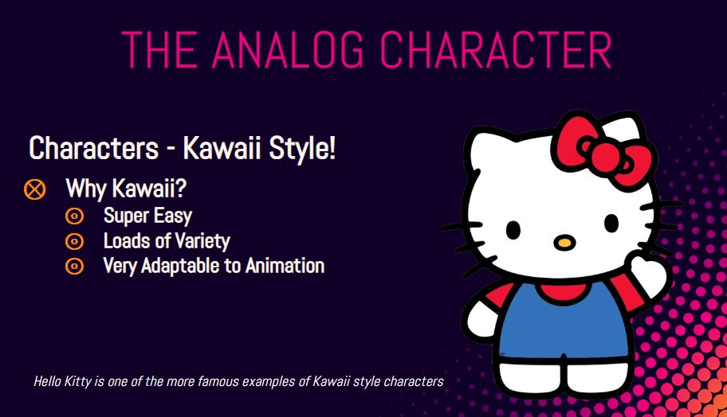
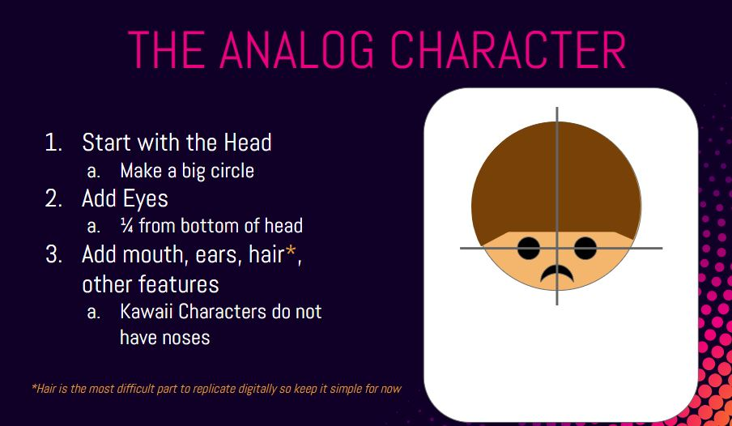
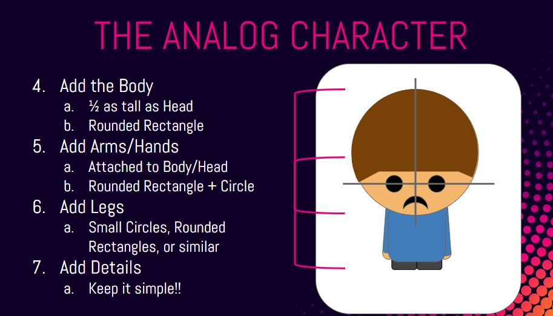
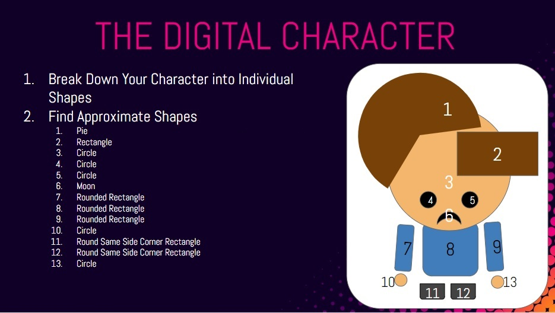
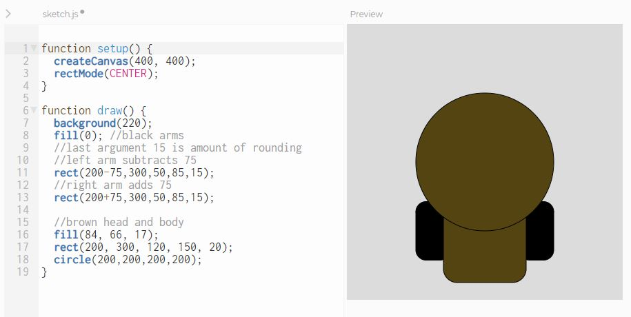
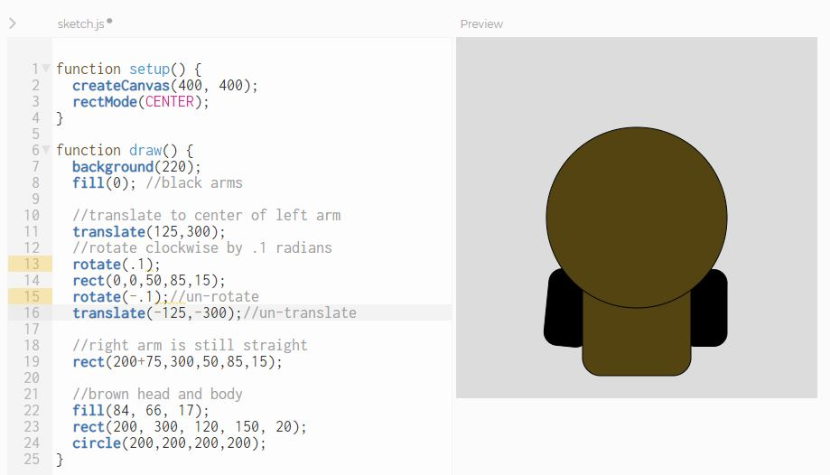

Kawaii Character
-------
In this lab you will use P5's graphics functions to depict a Kawaii character. The most familiar Kawaii character may be Hello Kitty. 
    
Use the instructions below as a guide in designing your own Kawaii character. You will find the [rect()](https://p5js.org/reference/#/p5/rect), [circle()](https://p5js.org/reference/#/p5/circle) and [arc()](https://p5js.org/reference/#/p5/arc) functions useful. Note that you can used arc() to make pie shapes. You may also want to look at the full list of functions at [p5js.org/reference/](https://p5js.org/reference/).     
    
    
   

Submit the URL for your finished project to Google Classroom.

Optional: Rotating the arms
---------------------------
Here's a basic figure with arms straight at the side.
   
Notice that we are using `rectMode(CENTER)` so the left arm is centered at (125,300). Rotations are always about the origin, so we first need to `translate(125,300)` to move the origin to the center of the left arm. Then we can `rotate(.1)` to rotate the left arm a small amount in the clockwise direction and draw the arm at the new origin (0,0). After draw the left arm, we need to "un-rotate" and "un-translate" in *reverse order* so that the rest of the drawing is unaffected.
   

Samples of Student Work
-----------------------
[Katelyn](https://editor.p5js.org/jizhang6/present/l4Pc-2Az)   

*This lab was adapted from Chris Barrious' [Kawaii Character Assignment](https://docs.google.com/presentation/d/1PDTFHUDawHQqcy-0xr1BP7aRz37tE_1vwoR-HN5UwXo/edit?usp=sharing)*
