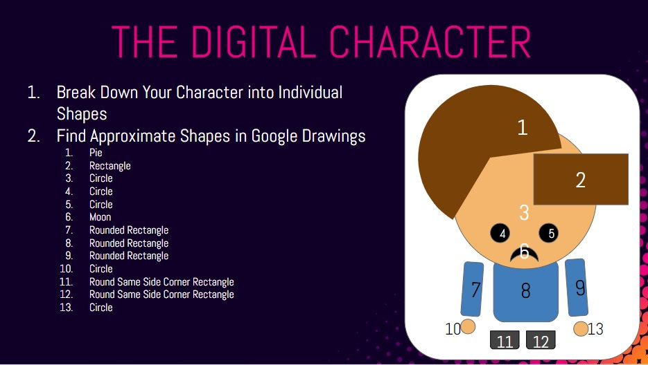

Kawaii
-------
In this lab you will use P5's graphics functions to depict a Kawaii character. You can access the full list of functions at [p5js.org/reference/](https://p5js.org/reference/). The most familiar Kawaii character may be Hello Kitty. Use the instructions below as a guide in designing your own Kawaii character: 
    
    
    
   

Submit the URL for your finished project to Google Classroom.

Samples of Student Work
-----------------------
None yet!   

*This lab was adapted from Chris Barrious' [Kawaii Character Assignment](https://docs.google.com/presentation/d/1PDTFHUDawHQqcy-0xr1BP7aRz37tE_1vwoR-HN5UwXo/edit?usp=sharing)*
